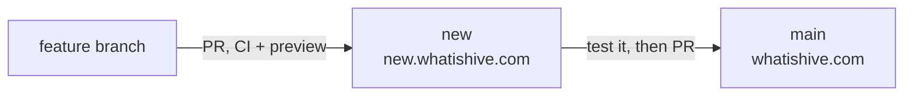

# Deployment

The site is hosted on **Netlify**, connected to this GitHub repository.

## Branches and sites

| Branch | Site | Purpose |
|---|---|---|
| `main` | https://whatishive.com | Production. Only reviewed changes land here. |
| `new` | https://new.whatishive.com | Staging: try new features on a real URL before they go live. Hidden from search engines, with a "Test site" banner. |
| any other branch | a Netlify deploy preview link on its PR | Work in progress. |

## How a change goes live

1. Make the change on a branch and open a pull request into **`new`**. CI runs the tests and Lighthouse, and Netlify posts a deploy preview link.
2. Merge it (by hand, after reviewing). Netlify deploys `new` to https://new.whatishive.com within a minute.
3. When you're happy with what's on staging, open a pull request from `new` into **`main`** and merge it with **"Create a merge commit"** (not "Squash and merge"). Netlify publishes it to https://whatishive.com.

   Why a merge commit: squashing copies `new`'s changes into a brand-new commit on `main`, so the two branches no longer share history and the next pull request into `new` shows conflicts even though the files are identical. Feature branches going into `new` can be squashed as usual.

Small fixes can go straight to a PR into `main` if they don't need testing on staging. PRs are never merged automatically.

### How staging differs from production

Every Netlify build runs `npm test && node scripts/staging.mjs site`. The staging script does nothing unless the branch being built is `new` (Netlify sets `BRANCH` during builds). For `new`, on Netlify's build copy only, it:

- replaces `robots.txt` with `Disallow: /`, sends `X-Robots-Tag: noindex, nofollow`, and adds a `noindex` meta tag to every page, so the test site never competes with the real one in search;
- adds a "Test site: changes here are not live yet" banner linking to whatishive.com.

Canonical URLs still point at whatishive.com. `tests/staging.test.mjs` checks the script.

### One-time setup (for reference)

Netlify's "branch subdomain" feature only works when the domain's DNS is on Netlify, and whatishive.com's DNS is on Cloudflare. So staging is a **second Netlify project** built from the same repository, with `new` as its production branch:

1. **Netlify → Projects → Add new project → Import an existing project → GitHub → `walterjay/whatishivecom`.** Set **Branch to deploy** to `new`, leave the build settings alone (`netlify.toml` provides them), name it `whatishive-new`, and deploy.
2. **In that project → Project configuration → Build & deploy → Continuous deployment → Branches and deploy contexts → Configure:** Branch deploys **Deploy only the production branch**; Deploy Previews **Don't deploy Deploy Previews** (the main project already builds previews for PRs).
3. **In that project → Domain management → Add a domain:** `new.whatishive.com`. Netlify then asks for a DNS record.
4. **Cloudflare → whatishive.com → DNS → Add record:** type `CNAME`, name `new`, target `whatishive-new.netlify.app`, **Proxy status: DNS only** (grey cloud), so Netlify can issue the HTTPS certificate automatically.

## Netlify settings

Everything that matters lives in `netlify.toml`, which **overrides the Netlify dashboard**:

| Setting | Value | Why |
|---|---|---|
| Publish directory | `site` | Only the website files are public, never tests or docs. |
| Build command | `npm test` | A failing test stops the deploy. |
| Node version | 24 | Matches `.nvmrc` and CI. |
| Headers | CSP, nosniff, referrer and permissions policies | Security hardening; see [Project structure](Project-Structure.md). |

The domain (whatishive.com, with www redirecting to it) and HTTPS certificate are configured in the Netlify dashboard under **Domain management**. Nothing in the repo controls them.

## Rolling back

Either of these works:

- **Fastest:** Netlify dashboard → **Deploys** → pick an earlier deploy → **Publish deploy**. Instant, but the next push to `main` will deploy over it.
- **Proper:** revert the bad commit on GitHub (open the PR → **Revert**, or `git revert <sha>`), then merge. Netlify deploys the reverted version.

## The previous version

The original Angular version built with Google AI Studio is preserved at the git tag **`v1-angular`**: https://github.com/walterjay/whatishivecom/tree/v1-angular
